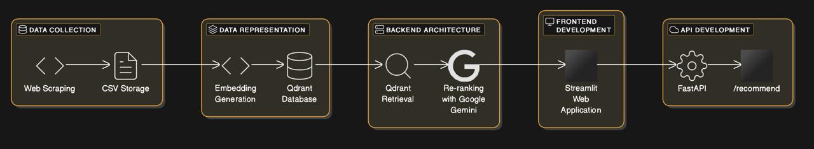
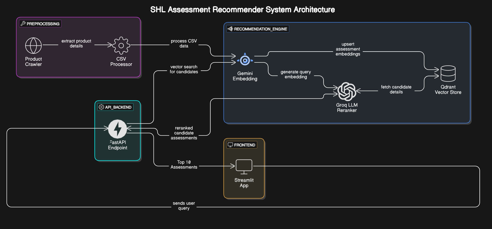

PROBLEM STATEMENT:

Hiring managers often struggle to find the right assessments for the roles that they are hiring for. The current system relies on keyword searches and filters, making the process time-consuming and inefficient Given a dataset of SHL assessments, we need to build an intelligent system that recommends the most relevant test based on a user-provided input query or job description. The goal is to simplify and optimize assessment selection for hiring and development purposes.

TOOLS AND LIBRARIES USED:

- Beautiful Soup - Web scraping SHL product data and Job Description URL
- Pandas - Data manipulation and CSV handling
- Qdrant - Vector database for embedding storage and retrieval
- Gemini API - Generating embeddings using Gemini Embedding model Google's text-embedding-004
- Groq API (llama-3.3-70b-versatile) - LLM-based re-ranking of retrieved assessments
- FastAPI - Building RESTful API endpoints
- Streamlit - Frontend framework for building the interactive web application

KEY HIGHLIGHTS: 
- Natural language processing  
- Multi-criteria recommendations  
- Instant JSON export  
- Dual input methods (text/URL).

METHODOLOGY:

API Endpoint: https://shl-recommendation-system-fpr1.onrender.com

System Arhictecture Diagram:
